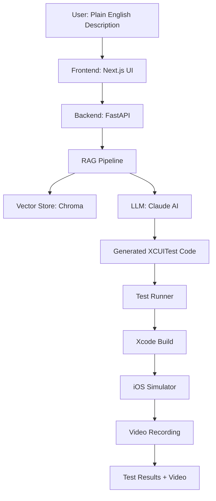
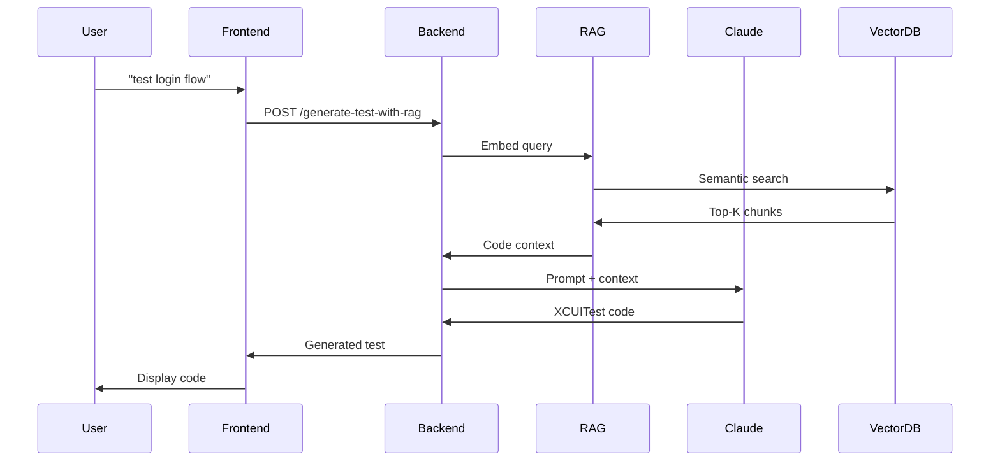
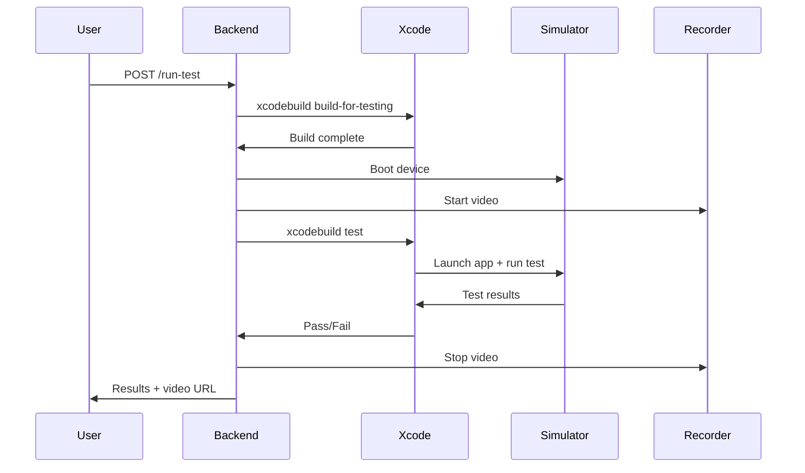

# Architecture Overview

How Testara works under the hood.

## High-Level Architecture



## Components

### 1. Frontend (Next.js)

**Location:** `/frontend`

- Modern React-based UI
- Real-time test generation interface
- Code preview with syntax highlighting
- Test execution controls
- Video playback

**Tech Stack:**
- Next.js 14 (App Router)
- TypeScript
- Tailwind CSS

### 2. Backend (FastAPI)

**Location:** `/backend`

- REST API for test generation and execution
- RAG pipeline coordination
- LLM interaction
- Test file management
- Video recording orchestration

**Key Endpoints:**
- `POST /generate-test-with-rag` — Generate test from description
- `POST /run-test` — Execute test in simulator
- `GET /recordings/{id}` — Retrieve test video

### 3. RAG Pipeline

**Location:** `/rag`

Retrieval-Augmented Generation pipeline that understands your iOS codebase.

#### Components:

**Ingestion (`rag/ingestion.py`):**
- Scans Swift source files
- Extracts code structure with tree-sitter
- Chunks code into semantic units
- Generates embeddings
- Stores in vector database

**Chunking (`rag/chunker.py`):**
- SwiftUI view extraction
- UIKit ViewController parsing
- Accessibility identifier detection
- Navigation pattern recognition
- Storyboard/XIB parsing

**Retrieval (`rag/service.py`):**
- Semantic search over codebase
- Top-K relevant chunks
- Context window management

### 4. Code Understanding

#### Tree-sitter AST Parsing

**Purpose:** Robust, accurate code analysis

- Parses Swift source into Abstract Syntax Tree
- Extracts UIView properties (UIKit)
- Detects SwiftUI element labels
- Finds accessibility identifiers
- Maps view hierarchies

#### Swizzled Accessibility IDs

**UIKit Convention:**
```swift
class LoginViewController: UIViewController {
    let submitButton = UIButton()  
    // Runtime ID: "LoginViewController.submitButton"
}
```

**SwiftUI Explicit IDs:**
```swift
Button("Login") { }
    .accessibilityIdentifier("loginButton")
```

### 5. Test Generation

**Location:** `/backend/app/services/test_generator.py`

#### Process:

1. **Enrichment:** Expand vague descriptions into detailed test specs
2. **Context Retrieval:** Find relevant code chunks via RAG
3. **Prompt Construction:** Build context-aware prompt for LLM
4. **Generation:** Claude generates XCUITest code
5. **Validation:** Syntax check and quality scoring

#### Confidence Levels:

- **Explicit:** Set via `.accessibilityIdentifier()` in code
- **Inferred:** Derived from property names (UIKit swizzling)
- **Heuristic:** Guessed from visible labels/text

### 6. Test Execution

**Location:** `/backend/app/services/test_runner.py`

#### Workflow:

1. **Write Test:** Save generated code to `LLMGeneratedTest.swift`
2. **Build:** `xcodebuild build-for-testing`
3. **Launch Simulator:** Boot and bring to foreground
4. **Start Recording:** `xcrun simctl io <device> recordVideo`
5. **Run Test:** `xcodebuild test -only-testing:<test>`
6. **Stop Recording:** Terminate video capture
7. **Parse Results:** Extract pass/fail status

## Data Flow

### Test Generation Flow



### Test Execution Flow



## Next Steps

- [Deep dive into RAG Pipeline](rag.md)
- [Understand Test Generation](generation.md)
- [Learn about Tree-sitter Integration](../advanced/customization.md)
