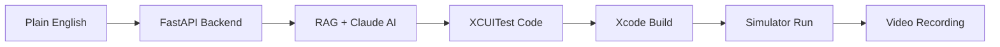

# Testara

**AI-powered iOS test automation** — Describe a test. Get a video.

<div class="grid cards" markdown>

-   :material-clock-fast:{ .lg .middle } __From Plain English to Passing Tests__

    ---

    Write "test login flow" and get working XCUITest code that runs automatically in the simulator with video proof.

    [:octicons-arrow-right-24: Quick Start](getting-started/quickstart.md)

-   :material-robot:{ .lg .middle } __AI-Powered Code Understanding__

    ---

    Uses Claude + RAG + tree-sitter AST parsing to read your Swift codebase and generate accurate, compile-ready tests.

    [:octicons-arrow-right-24: How It Works](architecture/overview.md)

-   :material-shield-lock:{ .lg .middle } __Privacy-First__

    ---

    Your code never leaves your machine. Self-hosted, open source, and runs entirely locally.

    [:octicons-arrow-right-24: Installation](getting-started/installation.md)

-   :material-scale-balance:{ .lg .middle } __Open Source__

    ---

    MIT Licensed. Use it, fork it, contribute to it. Built by developers, for developers.

    [:octicons-arrow-right-24: Contributing](contributing/guide.md)

</div>

## What is Testara?

Testara is an AI-powered tool that **generates and runs iOS UI tests** from plain English descriptions. 

Instead of spending hours writing XCUITest code manually, you describe what you want to test, and Testara:

1. **Reads your Swift codebase** using RAG + tree-sitter AST parsing
2. **Generates compile-ready XCUITest code** using Claude AI
3. **Runs the test automatically** in the iOS simulator
4. **Records video proof** of the test execution

## Key Features

- ✨ **Plain English to Code** — Write "test checkout flow" and get working XCUITest code
- 🧠 **Code-Aware** — Reads your actual Swift source to find real accessibility IDs and UI elements
- ⚡ **Fast** — Generate and run tests in 30-60 seconds
- 🎯 **Accurate** — No hallucinated selectors — uses only elements that exist in your code
- 🎥 **Visual Proof** — Every test run is recorded as video
- 🔒 **Private** — Your code stays on your machine
- 🆓 **Open Source** — MIT licensed, self-hosted

## Architecture



## Quick Example

**Input:**
```
Test login with invalid password shows error
```

**Generated Test:**
```swift
import XCTest

final class LoginTests: XCTestCase {
    func testLoginWithInvalidPassword() throws {
        let app = XCUIApplication()
        app.launchArguments = ["-AppleLanguages", "(en)"]
        app.launch()
        
        let emailField = app.textFields["emailTextField"]
        XCTAssertTrue(emailField.waitForExistence(timeout: 5))
        emailField.tap()
        emailField.typeText("user@test.com")
        
        let passwordField = app.secureTextFields["passwordTextField"]
        passwordField.tap()
        passwordField.typeText("wrongpassword")
        
        app.buttons["loginButton"].tap()
        
        let errorLabel = app.staticTexts["errorLabel"]
        XCTAssertTrue(errorLabel.waitForExistence(timeout: 5))
    }
}
```

**Result:** ✅ Test passes, video recorded

---

## Get Started

Ready to automate your iOS testing? Follow the [Quick Start Guide](getting-started/quickstart.md) to get up and running in 5 minutes.
